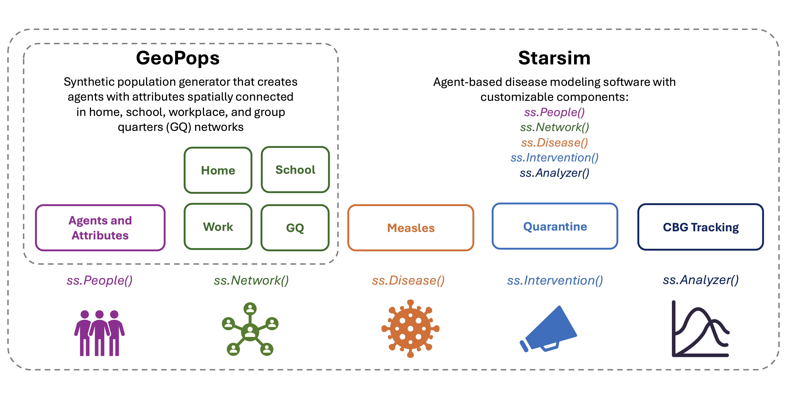

# GeoPops Measles Tutorial

This tutorial demonstrates how to simulate a measles outbreak in Spartanburg County, South Carolina, USA using the synthetic population generator, [GeoPops](https://github.com/GeoPopsHub/geopops), and the agent-based modeling software, [Starsim](https://starsim.org/). Think of this tutorial and measles example as a starting point of an iterative community-building modeling exercise. GeoPops and Starsim provide a customizable framework for a detailed, context-specific scenario model, but this version is the first draft! There is still a lot that can be added in collaboration with public health researchers and officials on the ground to make the population and model more realistic.

To start, read [GeoPops_Measles.pdf](https://github.com/GeoPopsHub/sc_spartanburg_measles/blob/main/GeoPops_Measles.pdf) for an overview of the GeoPops with Starsim framework as well as the measles outbreak in South Carolina.

Then, you can download the repo and go through the notebooks in order, or try out the interactive Marimo notebooks online. To use Marimo, simply click on a link below and fork the notebook using a Gmail or GitHub account. Then you can make your own changes without altering the source file. The first notebook explains how GeoPops works and how to make a population. It needs to be run locally, but you can still go through the other notebooks and Marimo links without doing so.  

| Notebook | Description | Marimo |
| -------- | -------- | -------- | 
| 1_run_geopops.ipynb | Make a GeoPops population of Spartanburg, SC | N/A |
| 2_explore_people.ipynb | Explore Starsim People object and compare GeoPops population to real Census data |  |
| 3_explore_networks.ipynb | Run a simple SIR model and see what happends when you change network edge weights |  |
| 4_measles_seeding.ipynb | Explore the custom measles model, seed infections to a specific school, and observe spatial spread |  |
| 5_measles_quarantine.ipynb | Eplore the custom measles model and test four quarantine strategies: - Infectious individual only - Infectious individual and siblings - Infectious individual and contacts - Entire school of infectious individual | |

## GeoPops with Starsim

The **GeoPops with Starsim** framework enables detailed scenario modeling because for every agent, we know:
* Several demographic characteristics (age, gender, race/ethnicity)
* Where they live and where they go to school or work
* Who infected them, when, and where (home, school, work, GQ)
* When they transition disease compartments (e.g., S, I, R)

Think of the framework like a puzzle. Each puzzle piece is a different model component (e.g., people, networks, disease). By customizing the logic and parameters of each component, you determine the how the puzzle pieces fit together and what picture they make.

All data used to make a GeoPops population are publicly available. All GeoPops and Starsim code is open source. AI-coding assistants can be super helpful to explain how things work and how to implement your own customizations.

In this tutorial, we’ll simulate a measles outbreak in Spartanburg County, SC and test different quarantine strategies. We’ll demonstrate how to seed initial infections by school and track infections by Census Block Group (CBG) over time. Don’t be intimidated by the code! All the important stuff is in the text and figures!

