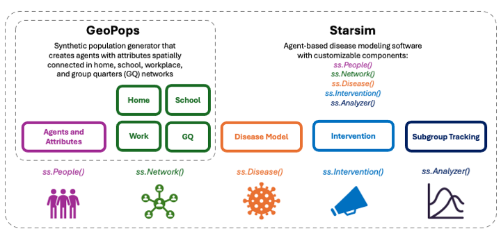

# GeoPops Measles Tutorial

This tutorial demonstrates how to simulate a measles outbreak in Spartanburg County, South Carolina, USA using the synthetic population generator, GeoPops, and the agent-based modeling software, Starsim. 

First, read [GeoPops_Measles.pdf](https://github.com/GeoPopsHub/sc_spartanburg_measles/blob/main/GeoPops_Measles.pdf) for an overview of the GeoPops with Starsim framework as well as the measles outbreak in South Carolina.

Then, you can download the repo and go through the notebooks in order, or try out the interactive Marimo notebooks online. To use Marimo, you simply fork the notebook using a Gmail or GitHub account, and then you can make your own changes in the notebook without affecting the source files. The first notebook explains how GeoPops works and how to make your own population. It needs to be run locally, but you can still go through the other notebooks without doing so.  

| Notebook | Description | Marimo |
| -------- | -------- | -------- | 
| 1_run_geopops.ipynb | Make a GeoPops population of Spartanburg, SC | N/A |
| 2_explore_people.ipynb | Explore Starsim People object and compare GeoPops population to real Census data |  |
| 3_explore_networks.ipynb | Run a simple SIR model and see what happends when you change network edge weights |  |
| 4_measles_seeding.ipynb | Seed infections to a specific school and observe spatial spread |  |
| 5_measles_quarantine.ipynb | Test four quarantine strategies: - Infected individual only - Infected individual and siblings - Infected individual and contacts - Entire school | |

## GeoPops with Starsim

*GeoPops Starsim overview diagram*